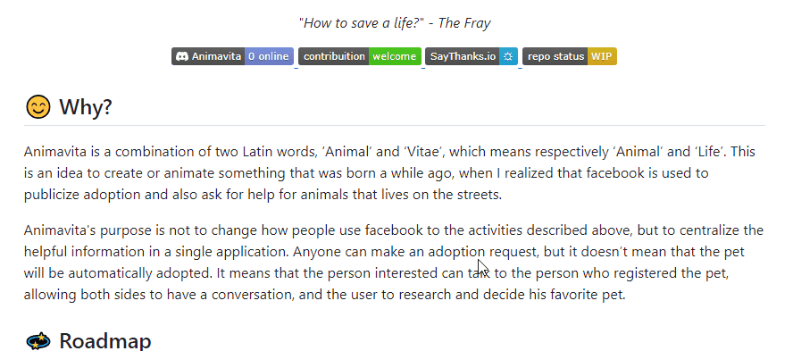

# Projeto com README
Um projeto de teste com um arquivo README 🚀

[]

## Tecnologias utilizades

- HTML


## Como utilizar 

O que eu aprendi com o README
```
Codígos de README 
Clona o projeto com: git clone <url>
```

Ferramentas de gravação de tela 
```
ScreenToGif
```